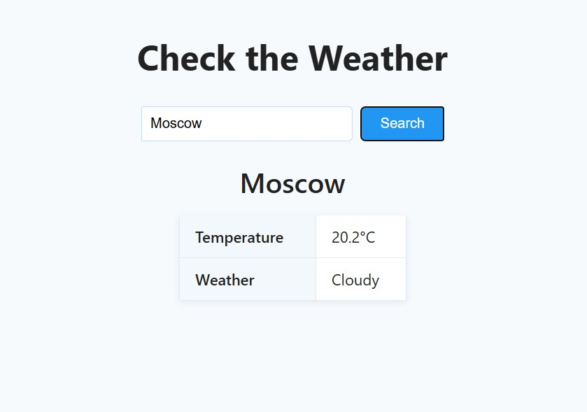
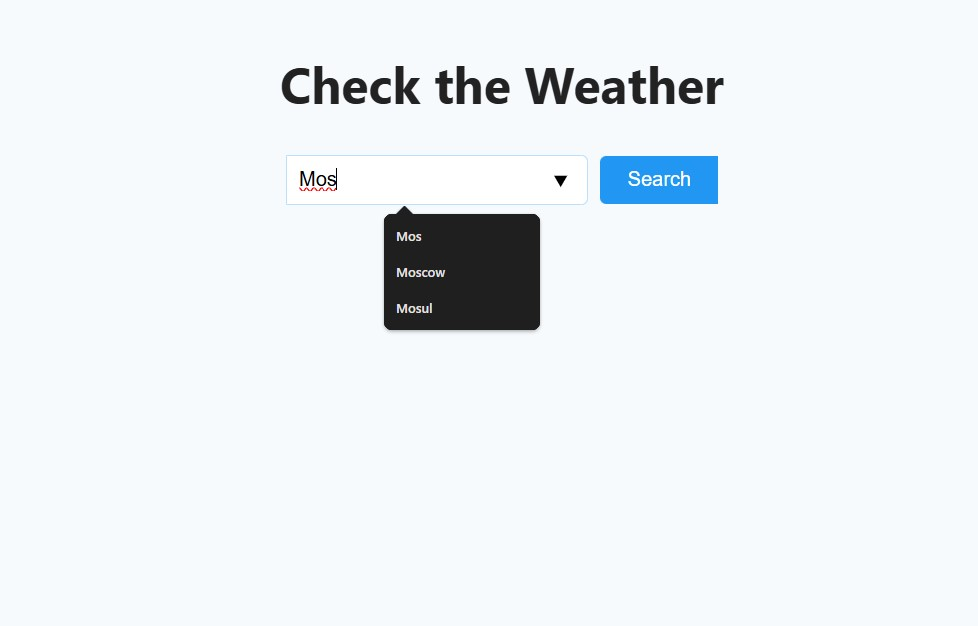

# O-Complex Test Task

This is a simple web application that allows users to check the current weather in any city.
By entering the name of a city, the app displays the current temperature and general weather conditions (e.g. clear, cloudy, etc.).

- FastAPI — modern, fast (high-performance) web framework for building APIs with Python.
- aiohttp — asynchronous HTTP client for making non-blocking API requests.
- Jinja2 — templating engine for rendering HTML pages.
- Uvicorn — lightning-fast ASGI server for running FastAPI applications.
- Docker — containerization platform for easy deployment.

## Run

Rename `.env-template` to `.env`

### Manually:

1. Instal dependencies from `requirements.txt`
2. Run `uvicorn src.main:app`

### Docker:

1. Run `docker build -t [image_name] .`
2. Run `docker run -p [port:port] [image_name]`

## Examples

